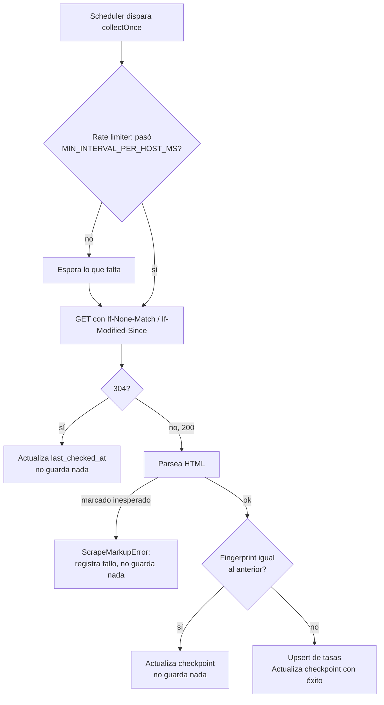

# Recolección de datos de referencia (web scraping)

Cubre las dos extensiones opcionales de web scraping del enunciado:
**recolección de datos de referencia** y **confiabilidad de la recolección**.
Implementadas juntas en un servicio nuevo,
[`reference-data-service`](../reference-data-service), porque la segunda
extensión (rate limiting, timeouts, reintentos, requests condicionales,
deduplicación, checkpointing) no tiene sentido sin la primera — son la misma
pieza de código vista desde dos ángulos.

## Por qué esto no afecta el flujo de negocio

Nada en `transaction-service` ni en `antifraud-service` importa, llama, ni
depende de este servicio de ninguna forma — ni por HTTP, ni por Kafka, ni
compartiendo una tabla de negocio. `reference-data-service` comparte la
misma instancia de Postgres solo por conveniencia operativa (un
`docker-compose.yml` en vez de dos), en tablas propias
(`reference_rate_sources`, `reference_rates`) sin ninguna foreign key hacia
`transactions`. **La regla de fraude (`value > 1000` → `rejected`) no lee
ningún dato de esta fuente y sigue funcionando exactamente igual si
`reference-data-service` está caído, nunca arrancó, o la fuente externa
dejó de responder** — es el requisito explícito de la extensión ("el core
de la decisión de fraude debe seguir disponible cuando la fuente no lo
está"), cumplido por construcción (aislamiento de proceso), no por manejo de
errores defensivo.

## La fuente: tasas de referencia del Banco Central Europeo

```
https://www.ecb.europa.eu/stats/policy_and_exchange_rates/euro_reference_exchange_rates/html/index.en.html
```

Elegida por:

- **Es HTML de verdad, no una API JSON disfrazada** — el enunciado pide
  explícitamente scrapear una fuente HTML, no consumir un endpoint de datos.
- **Pública, lícita y sin autenticación.** Es información oficial publicada
  por un banco central para consumo general; la propia página dice
  "para fines informativos".
- **Estructura estable y semántica** (una tabla `<table class="forextable">`
  con una fila por moneda), lo que la hace un buen caso de estudio para la
  extensión de "confiabilidad de la recolección" sin quedar a merced de un
  sitio que reordena su marcado en cada visita.
- **Se actualiza una vez al día** (~16:00 CET), lo que hace que las
  conditional requests (ver abajo) sean la norma, no la excepción: la
  mayoría de las corridas de este servicio deberían terminar en un `304` o
  en "mismo fingerprint", no en una escritura nueva.

## Recolección de datos de referencia

`src/scrapers/ecbRatesScraper.js` extrae, de la página:

- La fecha de referencia publicada (`.jumbo-box .upper h3`, ej. "26 August
  2026").
- Una fila por moneda: código (`td.currency`) y tasa contra EUR
  (`td.spot .rate`).

Se persiste con:

- **Fuente y fecha de retrieval**: `reference_rates.source_url` y
  `retrieved_at`.
- **Fingerprint de contenido**: SHA-256 de las tasas ya extraídas y
  normalizadas (no del HTML crudo — ver "Deduplicación" abajo).
- **Upsert por `(source_id, quote_currency, rate_date)`**: reprocesar la
  misma corrida (mismo día publicado) es idempotente, nunca duplica filas.

Un HTML que no tiene la tabla o la fecha esperadas **no** produce una lista
vacía o parcial en silencio: `parseEcbRatesHtml` lanza `ScrapeMarkupError`
con un mensaje que indica qué selector faltó. `collector.js` atrapa ese
error, lo cuenta en `/metrics`
(`reference_data_collection_runs_total{result="markup_error"}`) y lo
loguea — pero no guarda nada ni corrompe el último dato bueno que ya estaba
en la tabla. Esto se prueba con dos fixtures reales en
`test/fixtures/`: `ecb-rates.html` (una copia real de la página, capturada
para este proyecto) y `ecb-rates-changed-markup.html` (la misma página con
las clases `forextable` y `rate` renombradas a mano, simulando un cambio de
marcado) — ver `test/ecbRatesScraper.test.js`.

## Confiabilidad de la recolección

Todo vive en `src/http/fetchWithPoliteness.js`, `src/http/hostRateLimiter.js`
y `src/collector.js`:

| Requisito de la extensión      | Dónde                                                                 |
|----------------------------------|------------------------------------------------------------------------|
| Rate limiting por host           | `HostRateLimiter`: mínimo `MIN_INTERVAL_PER_HOST_MS` entre dos requests al mismo hostname. Con una sola fuente hoy, equivale a la cadencia de `POLL_INTERVAL_MS`; queda expresado por host para no romper la cortesía si se agrega una segunda fuente. |
| Timeouts                         | `AbortController` + `FETCH_TIMEOUT_MS` en cada request.               |
| Reintentos acotados con backoff  | `withRetry` (mismo patrón que `antifraud-service`) — solo ante fallos transitorios (timeout, 5xx); un 4xx no se reintenta, se considera un error permanente. |
| Requests condicionales           | `If-None-Match`/`If-Modified-Since` con el `etag`/`last_modified` guardados de la corrida anterior; un `304` no descarga ni reprocesa nada. |
| Deduplicación                    | Fingerprint SHA-256 del contenido ya extraído (no del HTML crudo, que cambia por ruido irrelevante — banners, espacios). Si el fingerprint no cambió, no se reescribe la fila aunque la fuente haya respondido `200`. |
| Progreso con checkpoint          | `reference_rate_sources` (una fila por fuente) guarda `etag`, `last_modified`, `last_fingerprint` y `last_checked_at`/`last_success_at` en Postgres — no en memoria. Un restart del proceso lee ese estado y continúa exactamente donde se había quedado, en vez de perder el avance o volver a descargar de cero. |
| Fixtures para tests              | Ver arriba — ningún test de este proyecto depende de la red ni de que el sitio del BCE siga respondiendo igual mañana. |

## Qué pasa en cada corrida



## Cómo probarlo

```bash
cd reference-data-service
npm install
npm run migrate
npm test              # usa fixtures, no toca la red
npm start             # recolección real contra el BCE, cada POLL_INTERVAL_MS
curl http://localhost:3002/reference-rates/usd
```
